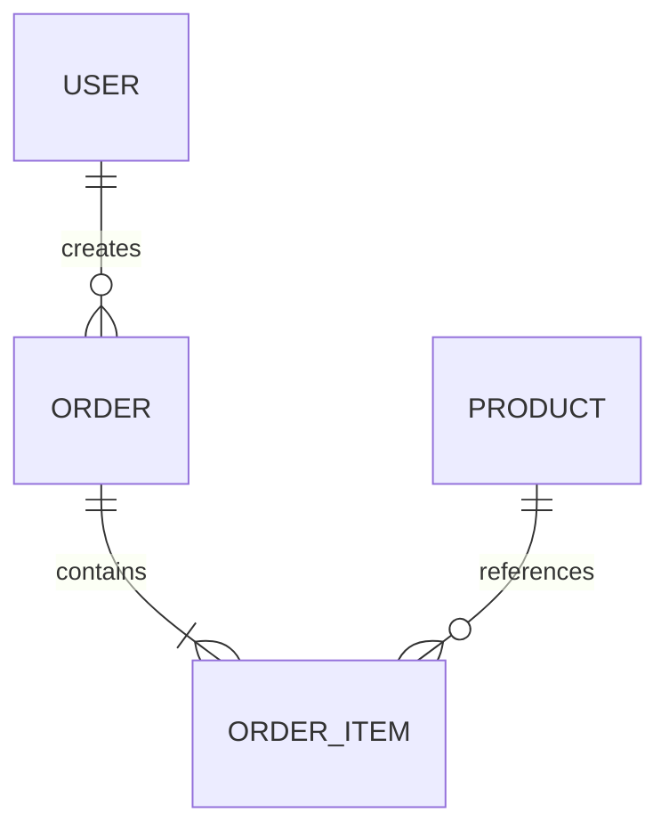

# 数据结构设计

## 1. ER 图

---

## 2. MySQL

字段约束与索引依据已确认的业务规则和现有表结构填写，不自动添加默认值或索引。
可空填写“是”或“否”；默认值需区分“无默认值”和 `NULL`。
各表列出实际使用的主键、唯一索引和普通索引，联合索引按实际字段顺序填写，并说明用途。

### `user`

| 字段 | 类型 | 可空 | 默认值 | 说明 |
|---|---|---|---|---|
| id | bigint | XXX | XXX | 用户 ID |
| username | varchar(100) | XXX | XXX | 用户名 |
| create_time | datetime | XXX | XXX | 创建时间 |

#### 索引

| 索引名称 | 字段（按顺序） | 类型 | 用途 |
|---|---|---|---|
| XXX | XXX | 主键／唯一／普通 | XXX |

### `order`

| 字段 | 类型 | 可空 | 默认值 | 说明 |
|---|---|---|---|---|
| id | bigint | XXX | XXX | 订单 ID |
| user_id | bigint | XXX | XXX | 用户 ID |
| amount | decimal(18,2) | XXX | XXX | 订单金额 |
| status | varchar(32) | XXX | XXX | 订单状态 |
| create_time | datetime | XXX | XXX | 创建时间 |

#### 索引

| 索引名称 | 字段（按顺序） | 类型 | 用途 |
|---|---|---|---|
| XXX | XXX | 主键／唯一／普通 | XXX |

### `order_item`

| 字段 | 类型 | 可空 | 默认值 | 说明 |
|---|---|---|---|---|
| id | bigint | XXX | XXX | 明细 ID |
| order_id | bigint | XXX | XXX | 订单 ID |
| product_id | bigint | XXX | XXX | 商品 ID |
| product_name | varchar(200) | XXX | XXX | 商品名称 |
| price | decimal(18,2) | XXX | XXX | 下单价格 |
| quantity | int | XXX | XXX | 购买数量 |

#### 索引

| 索引名称 | 字段（按顺序） | 类型 | 用途 |
|---|---|---|---|
| XXX | XXX | 主键／唯一／普通 | XXX |

### `product`

| 字段 | 类型 | 可空 | 默认值 | 说明 |
|---|---|---|---|---|
| id | bigint | XXX | XXX | 商品 ID |
| name | varchar(200) | XXX | XXX | 商品名称 |
| price | decimal(18,2) | XXX | XXX | 商品价格 |
| stock | int | XXX | XXX | 库存 |
| status | varchar(32) | XXX | XXX | 商品状态 |

#### 索引

| 索引名称 | 字段（按顺序） | 类型 | 用途 |
|---|---|---|---|
| XXX | XXX | 主键／唯一／普通 | XXX |

---

## 3. Redis

### `product:{productId}`

类型：`Hash`

| 字段 | 类型 | 说明 |
|---|---|---|
| name | String | 商品名称 |
| price | String | 商品价格 |
| stock | Integer | 商品库存 |
| status | String | 商品状态 |

### `cart:{userId}`

类型：`Hash`

| 属性 | 类型 | 说明 |
|---|---|---|
| field | productId | 商品 ID |
| value | Integer | 购买数量 |

---

## 4. MQ

### `order-created`

| 字段 | 类型 | 说明 |
|---|---|---|
| orderId | Long | 订单 ID |
| userId | Long | 用户 ID |
| amount | Decimal | 订单金额 |
| createTime | Long | 创建时间 |

---

## 5. 其他数据结构

### `xxx`

类型：`XXX`

| 字段 / 属性 | 类型 | 说明 |
|---|---|---|
| xxx | xxx | xxx |
| xxx | xxx | xxx |
