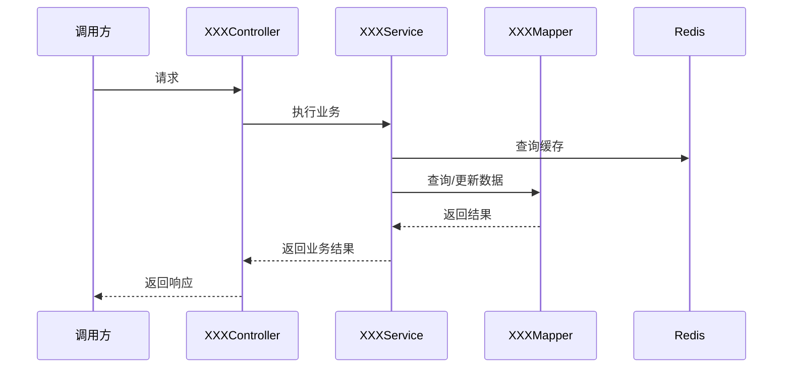
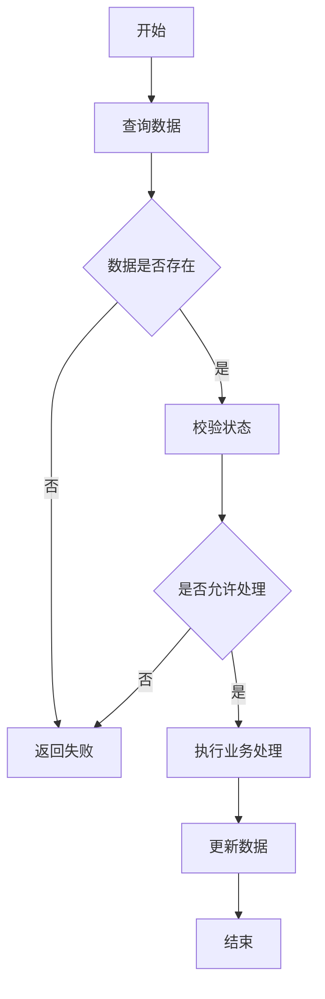

# 详细设计

> 生成过程中发现关键实现规则不明确时，应先实时澄清。  
> 最终文档只记录已经确定的设计。

## 1. 设计概述

### 实现目标

简要说明本次实现内容。

### 需求场景对应

需求文档：[需求分析](需求分析.md)。按实际文档位置更新链接。

沿用需求文档中的场景编号和名称，不另行编号。逐项列出需求场景对应的实现入口、关联接口、关联数据结构和设计位置，避免遗漏；不属于本次实现范围的场景，注明已确认的范围依据。

实现入口按实际情况填写，可以是 Controller、定时任务或消息消费者。接口和数据结构引用对应文档的具体章节，能使用链接时使用链接；一个场景涉及多个接口或数据结构时全部列出。不涉及的项目填写“不涉及”，尚未明确的关联应在设计完成前解决。

| 场景编号 | 场景 | 实现入口 | 关联接口 | 关联数据结构 | 设计位置 |
|---|---|---|---|---|---|
| S-001 | 场景一 | XXXController.xxx() | [接口设计](接口设计.md) §2.1 | [数据结构设计](数据结构设计.md) 中实际使用的表／缓存／消息章节 | 本文 §4.1 |
| S-002 | 场景二 | XXXController.yyy() | [接口设计](接口设计.md) §2.2 | [数据结构设计](数据结构设计.md) 中实际使用的表／缓存／消息章节 | 本文 §4.2 |

### 涉及模块

| 模块 | 作用 | 变更 |
|---|---|---|
| XXX Controller | 接收 XXX 请求 | 新增/修改 |
| XXX Service | 处理 XXX 业务 | 新增/修改 |
| XXX Mapper | 处理 XXX 数据 | 新增/修改 |
| XXX Client | 调用 XXX 服务 | 新增/修改 |

---

## 2. 整体流程



### 流程说明

1. XXXController 接收 XXX 请求。
2. XXXService 校验 XXX。
3. 查询 XXX 数据。
4. 执行 XXX 处理。
5. 更新 XXX。
6. 返回处理结果。

---

## 3. 模块设计

本章说明类与方法的职责、参数返回及多个场景共用的方法行为。同一段逻辑只在一处完整描述：仅服务于单个场景的业务步骤写入第 4 章；共用方法行为在本章描述，场景章节引用并说明调用条件。
这里的“共用”指已有或已确定的方法，不要求为了文档结构额外抽取公共方法；代码仍遵守项目 `AGENTS.md` 中的方法抽取规则。

### 3.1 `XXXController`

用途：处理 XXX 接口请求。

| 方法 | 参数 | 返回 | 说明 |
|---|---|---|---|
| `xxx()` | `XXXRequest` | `XXXResponse` | XXX |

处理：

```text
接收请求
→ 参数校验
→ 调用 Service
→ 返回结果
```

---

### 3.2 `XXXService`

用途：实现 XXX 核心业务。

#### `xxx()`

```java
xxx(XXXRequest request)
```

职责：XXX。

参数：`XXXRequest`，说明 XXX。

返回：XXX。

共用方法行为（按需）：

仅当多个场景共用本方法时，说明统一的处理步骤和关键分支；场景专属流程在第 4 章按场景编号展开。

- 处理步骤：XXX。
- 关键分支：XXX。

---

### 3.3 `XXXMapper / Repository`

用途：负责 XXX 数据访问。

| 方法 | 说明 |
|---|---|
| `selectById()` | 查询 XXX |
| `updateStatus()` | 修改状态 |
| `insert()` | 新增 XXX |

---

### 3.4 Redis / MQ / 外部服务

仅实际涉及的时候保留。

#### Redis

```text
Key: xxx:{id}
```

用途：XXX。

涉及操作：

```text
GET
SET
DEL
```

#### MQ

```text
Topic: xxx-topic
```

用途：发送 XXX 事件。

#### 外部服务

```text
XXXClient.xxx()
```

用途：调用 XXX 获取/处理 XXX。

---

## 4. 场景实现设计

按需求场景编号逐个说明实现方式，覆盖该场景的调用顺序、业务判断、状态变化、异常与边界及验收标准。场景专属逻辑集中在本章描述；共用方法行为引用第 3 章并说明调用条件，事务、并发和幂等策略引用第 5 章并说明在本场景中的使用位置，避免重复展开。

场景对应表用于核对设计覆盖，不代表代码已实现或验收已通过；实施后需按相同场景编号核对实际代码和验证结果。

### 4.1 S-001 场景一

对应需求：需求分析中的 `S-001 场景一`。

#### 实现位置

| 模块／方法 | 在本场景中的职责 |
|---|---|
| XXXController.xxx() | XXX |
| XXXService.xxx() | XXX |
| XXXMapper.xxx() | XXX |

#### 处理流程



#### 处理规则

- XXX 时执行 XXX。
- XXX 状态禁止 XXX。
- XXX 重复请求不重复处理。
- XXX 失败时执行 XXX。

#### 异常与边界对应

| 需求中的异常／边界 | 判断位置 | 处理方式 |
|---|---|---|
| XXX | XXXService.xxx() | XXX |

#### 验收对应

| 需求中的验收标准 | 实现方式／位置 | 验证方式 |
|---|---|---|
| XXX | XXX | XXX |

---

### 4.2 S-002 场景二

对应需求：需求分析中的 `S-002 场景二`。

#### 实现位置

| 模块／方法 | 在本场景中的职责 |
|---|---|
| XXXController.yyy() | XXX |
| XXXService.yyy() | XXX |
| XXXMapper.yyy() | XXX |

#### 处理步骤与规则

1. XXX。
2. XXX。
3. XXX。

#### 异常与边界对应

| 需求中的异常／边界 | 判断位置 | 处理方式 |
|---|---|---|
| XXX | XXXService.yyy() | XXX |

#### 验收对应

| 需求中的验收标准 | 实现方式／位置 | 验证方式 |
|---|---|---|
| XXX | XXX | XXX |

---

## 5. 事务、并发与异常

仅描述当前需求实际涉及的内容。

本章集中记录共用的事务边界、并发和幂等策略；第 4 章引用对应策略，并说明在具体场景中的使用位置。场景专属异常在第 4 章描述，本章仅保留共用异常处理。

### 事务

事务范围：XXX 方法中的 XXX 数据库操作。

提交条件：XXX。

回滚条件与范围：XXX。

事务外操作及失败处理（按需）：

| 操作 | 执行时机 | 失败后的状态 | 处理方式 |
|---|---|---|---|
| XXX | 提交前／提交后／异步 | XXX | XXX |

数据库事务回滚仅覆盖实际参与事务的操作。涉及 Redis、MQ 或外部服务时，明确其失败处理；仅在业务需要时设计重试或补偿。

### 并发

XXX 操作通过：

```text
条件更新 / 乐观锁 / 分布式锁
```

保证 XXX。

### 幂等

幂等标识：

```text
XXX
```

重复请求：

```text
直接返回已有结果 / 忽略重复处理
```

### 异常

| 场景 | 处理 |
|---|---|
| XXX 不存在 | 抛出 XXXException |
| 状态不允许 | 返回业务错误 |
| Redis 异常 | XXX |
| 外部服务失败 | XXX |
| 数据库更新失败 | 按上述事务边界及回滚条件处理 |

---

## 6. 代码变更

### 新增

```text
XXXController
XXXService
XXXMapper
XXXRequest
XXXResponse
```

### 修改

```text
XXXService
- 增加 xxx()

XXXMapper
- 增加 updateXxx()
```

### 删除

```text
无
```
