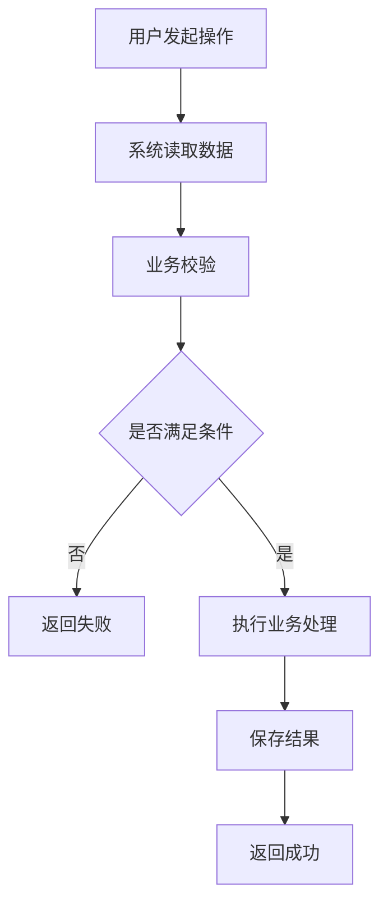
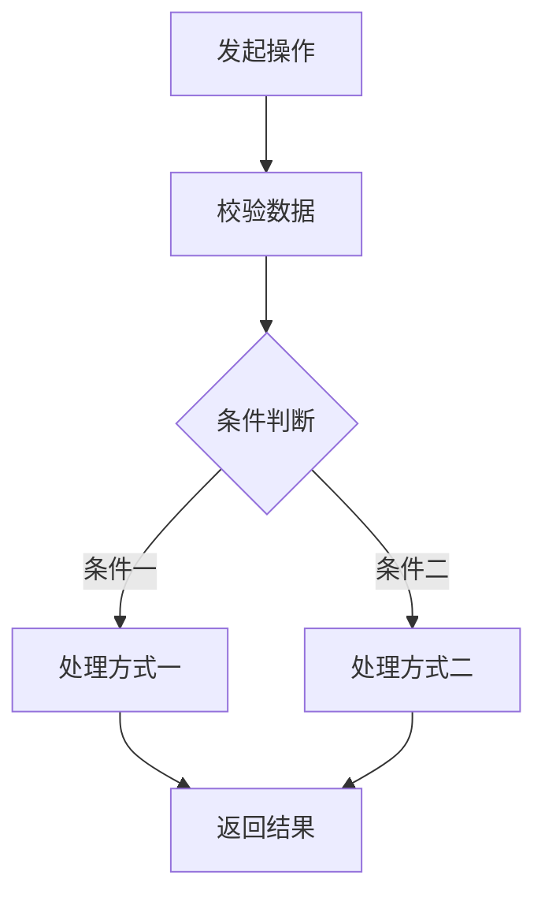
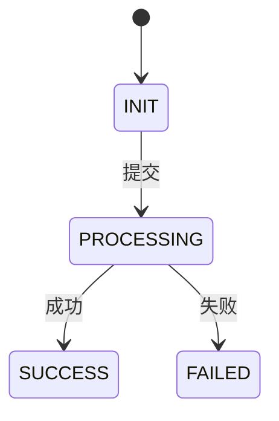

# 需求分析

> 生成规则：分析过程中如果发现关键规则缺失、描述冲突、流程不明确或异常处理方式不确定，应先实时向需求方澄清。  
> 最终文档只记录已经明确的结论，不保留待确认问题和未确认假设。

---

## 1. 需求理解

### 1.1 需求目标

说明该需求要解决什么问题。

- 目标：
- 使用对象：
- 最终结果：

### 1.2 功能范围

本次包含：

- XXX
- XXX
- XXX

本次不包含：

- XXX
- XXX

### 1.3 核心规则

只记录会影响业务流程的主要规则。

- XXX 必须满足 XXX。
- XXX 状态下允许 XXX。
- XXX 状态下禁止 XXX。
- XXX 发生变化时，按 XXX 处理。
- 重复操作按 XXX 处理。

---

## 2. 场景划分

按用户实际业务行为划分，不按接口或页面划分。

每个需要独立设计和验收的场景分配唯一编号，如 `S-001`、`S-002`。需要独立实现的子场景也单独编号；普通处理分支归入所属场景。
编号在本需求文档内唯一，场景树、场景列表、场景分析与详细设计使用相同编号和名称。
新增场景使用未使用的新编号；调整顺序或名称时保留原编号，已删除场景的编号不复用。

```text
功能名称

├── S-001 场景一
│   ├── 处理分支 A
│   └── 处理分支 B
│
└── S-002 场景二
    ├── 处理分支 A
    └── 处理分支 B
```

场景列表：

| 场景编号 | 场景 | 说明 |
|---|---|---|
| S-001 | 场景一 | XXX |
| S-002 | 场景二 | XXX |

---

## 3. 主要流程

仅对核心业务流程画流程图。



### 流程说明

用户执行 XXX 操作。

系统首先 XXX。

满足 XXX 条件后执行 XXX。

如果 XXX 不满足，则 XXX。

最终 XXX。

---

## 4. 场景分析

场景列表中的每个编号均需在本章展开，按实际场景数量增减。

### 4.1 S-001 场景一

#### 场景说明

说明用户在什么情况下执行该操作，以及最终需要达到什么结果。

#### 处理流程

如流程简单，可直接使用文字：

```text
用户发起操作
↓
校验数据
↓
查询业务数据
↓
执行业务规则
↓
保存结果
↓
返回结果
```

如存在多个明显分支，再使用 Mermaid：



#### 处理步骤

| 步骤 | 操作 | 说明 |
|---|---|---|
| 1 | XXX | XXX |
| 2 | XXX | XXX |
| 3 | XXX | XXX |
| 4 | XXX | XXX |

#### 异常与边界

| 情况 | 处理 |
|---|---|
| 数据不存在 | XXX |
| 状态不允许 | XXX |
| 参数为空 | XXX |
| 参数非法 | XXX |
| 数量达到边界 | XXX |
| 重复操作 | XXX |
| 并发操作 | XXX |
| 处理失败 | XXX |

#### 验收标准

描述可观察、可验证的业务结果。
异常与边界中已经明确的预期结果不重复填写。

| 前置条件 | 操作 | 预期结果 |
|---|---|---|
| XXX | XXX | XXX |

---

### 4.2 S-002 场景二

#### 场景说明

XXX

#### 处理步骤

| 步骤 | 操作 | 说明 |
|---|---|---|
| 1 | XXX | XXX |
| 2 | XXX | XXX |
| 3 | XXX | XXX |

#### 异常与边界

| 情况 | 处理 |
|---|---|
| XXX | XXX |
| XXX | XXX |
| XXX | XXX |

#### 验收标准

描述可观察、可验证的业务结果。
异常与边界中已经明确的预期结果不重复填写。

| 前置条件 | 操作 | 预期结果 |
|---|---|---|
| XXX | XXX | XXX |

---

## 5. 状态变化

仅当需求存在明确业务状态时保留本章节。



| 当前状态 | 操作 | 结果状态 | 是否允许 |
|---|---|---|---|
| INIT | XXX | PROCESSING | 是 |
| PROCESSING | XXX | SUCCESS | 是 |
| SUCCESS | XXX | - | 否 |

---
